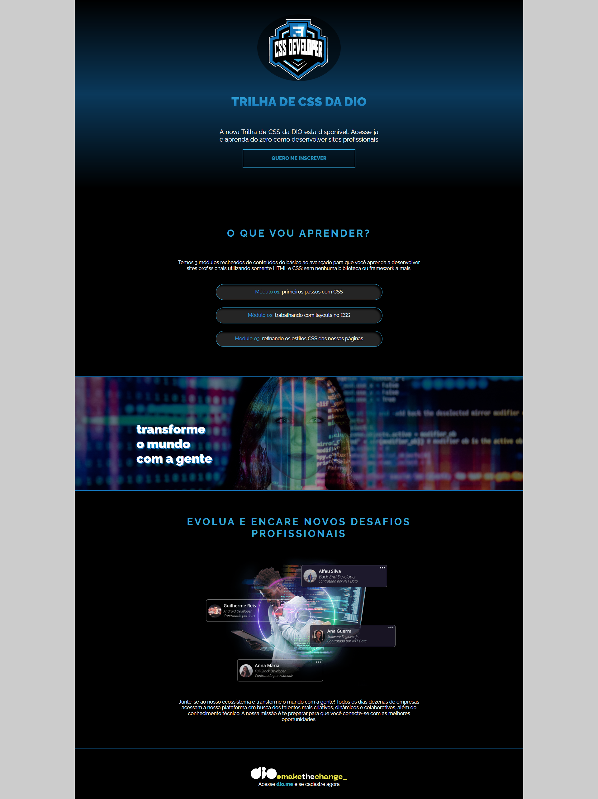

# lande-page-do-curso-de-css



Uma descrição curta e cativante do seu projeto. O que ele faz? Qual o objetivo dele? Fale sobre como você utilizou os conhecimentos de CSS do curso da DIO.

# 🚀 Tecnologias Utilizadas
Liste aqui as principais tecnologias que você usou no projeto. Isso demonstra seu conhecimento e ajuda quem for ver o código a entender rapidamente a base dele.

HTML5

CSS3

# ✨ Funcionalidades
O que seu site faz? Quais são as características que você implementou com CSS?

Estilização de botões e links.

Uso de seletores de CSS para estilizar elementos.

Adição de efeitos de hover.

Configuração de fontes e cores.

# 📁 Como Rodar o Projeto
Quer ver o projeto funcionando na sua máquina? É super simples!

Clone o repositório:
Bash
```
git clone https://github.com/Fagner-Lopes-Paiva/lande-page-do-curso-de-css.git
```
Abra a pasta do projeto:
Bash
```
cd lande-page-do-curso-de-css
```
Abra o arquivo index.html em seu navegador de preferência.

👩‍💻 Autor
Feito com dedicação por: Fagner Lopes Paiva